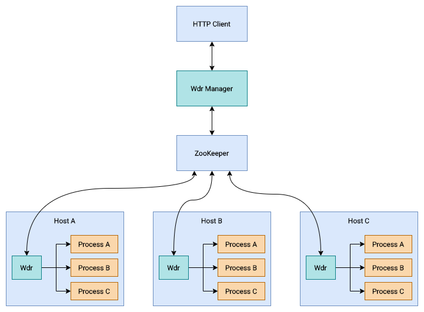

# Wdr

Wdr is a client-server process control system.

## Design



## Wdr (Server Side)

```
RUST_LOG=info cargo run -p wdr
```

## Wdr Manager (Client Side)

```
RUST_LOG=info cargo run -p wdrm
```

## Wdr Manager API

### Get Config

Request:

```
GET /config
```

Response:

```json
{
    "configs": [
        {
            "name": "hello",
            "version": "1",
            "resource": "https://example.com/path/to/hello",
            "cmd": "./hello"
        },
        {
            "name": "world",
            "version": "1",
            "resource": "https://example.com/path/to/world",
            "cmd": "./world"
        }
    ]
}
```

### Set Config

Request:

```json
POST /config
{
    "configs": [
        {
            "name": "hello",
            "version": "1",
            "resource": "https://example.com/path/to/hello",
            "cmd": "./hello"
        },
        {
            "name": "world",
            "version": "1",
            "resource": "https://example.com/path/to/world",
            "cmd": "./world"
        }
    ]
}
```

### Get Node Info

Request:

```
GET /info/{node_name}
```

Response:

```json
{
    "processInfoList": [
        {
            "name": "hello",
            "version": "1",
            "state": "running"
        },
        {
            "name": "world",
            "version": "1",
            "state": "downloading"
        }
    ]
}
```

### Get Node List

Request:

```
GET /node
```

Response:

```json
[
    "node-a-192.66.66.66",
    "node-b-192.77.77.77",
    "node-c-192.88.88.88"
]
```

### Delete Node

Request:

```
DELETE /node/{node_name}
```
